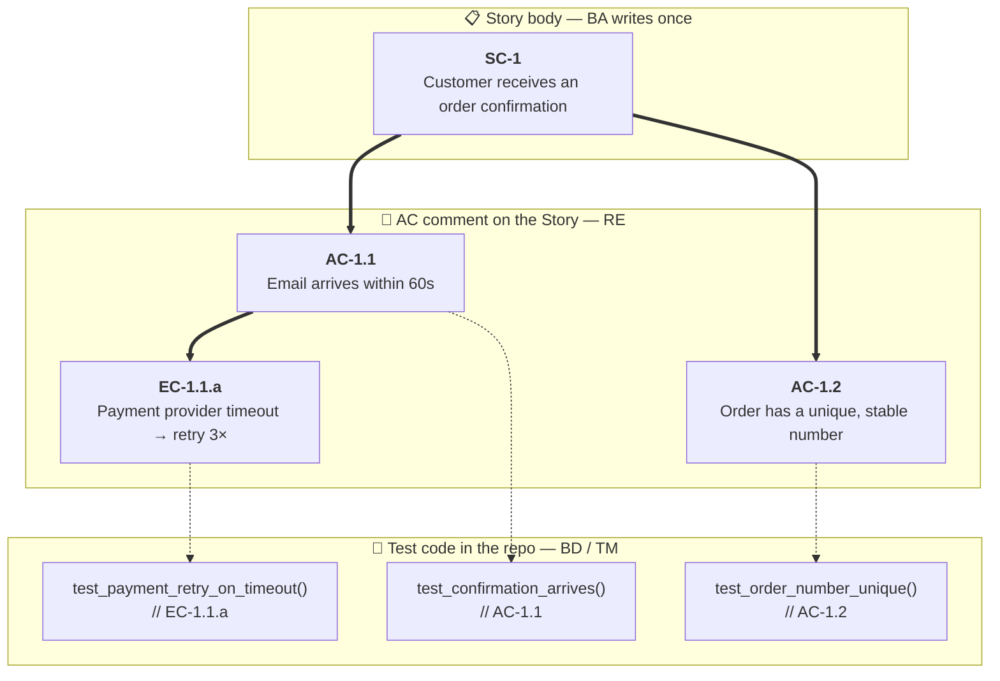

# Trail

*The audit trail for AI-assisted spec-driven engineering.*

**Engineering discipline for software you have to defend.**

A spec-driven methodology with audit-trail-by-construction: every
code change is attributable — in the project's ticket system, by
named role-account — to a designer, security reviewer, implementor,
and tester. The same ticket carries the requirement that motivated
the change, the acceptance scenarios it satisfies, and the test that
proves it.

> **Status:** early design / beta. Installable today via the
> `install-helper` agent (see [Install](#install)).

## What the discipline buys you

- **Description-once.** A Story body is written once on creation
  and never edited. Later annotation is comment-only — original
  intent stays readable, no version-skew.
- **Stable per-criterion IDs.** Every success criterion (`SC-N`),
  acceptance scenario (`AC-N`), edge case (`EC-N`), and
  non-functional requirement (`NFR-N`) carries a persistent,
  append-only ID that travels into test code as a comment. Trace
  any test back to the requirement it covers; any requirement back
  to the conversation in which it was settled.
- **Global hard guardrails.** A *control manifest* holds the
  non-negotiables — security, compliance, quality floors,
  architectural invariants — each with a stable `CM-N` ID. A Story
  that violates one is rejected at framing time, not at code
  review.
- **Per-role identity in the ticket bus.** Every comment and state
  change is attributed by role-account; the board *is* the audit
  log. Open it, scan a column, see who designed, reviewed,
  implemented, and tested any change.
- **Strict human-in-loop.** No autopilot. No ticket-triggered
  hand-off. No auto-finalization. Every turn is a slash command
  issued by a human; the ticket's `assignee` is a TODO list, not a
  trigger.

## What enforces it

Role-specific [Claude Code](https://claude.com/claude-code) agents
— one per discipline (business analyst, requirements engineer,
software architect, security reviewer, backend developer, …) —
each constrained to a role-specific prompt, MCP scope, and
[Plane](https://www.plane.so) account. The agents do not act
autonomously; they execute the discipline above, so it does not
slip under deadline pressure. Intent and accountability stay with
the human.

What the discipline produces in practice is a single, append-only
chain of stable IDs — from the requirement that motivated the work
down to the test that proves it:



A `grep` for `AC-1.1` traces a single criterion from BA intent down
to the line of code that proves it. The chain works in both
directions — intent → code (forward) or code → why (backward) —
and stays legible without anyone having to interpret it.

## The team

| | Agent | Trait | Role |
|---|---|---|---|
|        | **Venture Advisor**       | Hype-resistant            | Strategic advisor for founders; operates on a private "business" track. |
|       | **Business Analyst**      | Curious about the unsaid  | Turns feature ideas into stories; owns the backlog and priorities.      |
|  | **Requirements Engineer** | Pedantic about wording    | Adds testable acceptance criteria (Gherkin) and edge cases as a comment on the Story. |
|     | **Software Architect**    | Long-horizon              | Designs the solution; documents trade-offs and pitfalls.                |
|      | **Security Reviewer**     | Adversarial by default    | Strict, non-negotiable gate; maintains project security state.          |
|      | **Backend Developer**     | Sceptical of the happy path | Implements server-side changes.                                       |
|           | **UI Developer**          | State-empathic            | Implements frontend changes.                                            |
|           | **Test Manager**          | Fastidious about coverage | Owns test strategy and verification.                                    |
|       | **Technical Writer**      | Reads own draft as a stranger | Keeps docs, READMEs, and changelogs honest.                         |
|        | **Release Manager**       | Rollback-first            | Drives versioning, tagging, and release.                                |

More on what each agent reads, writes, and does:
[`doc/PERSONAS.md`](doc/PERSONAS.md). The handover sequence over a
Story's lifetime: [`doc/WORKFLOW.md`](doc/WORKFLOW.md).

## Spec-driven, without the document-pile

Each persona's hand-off produces the artefact a traditional spec
document would have held — captured as a Plane work-item or comment,
attributed to its author, traceable from why to test, regenerated as
the code evolves. PRD- and SDD-equivalent by construction; BRD-ready
when strategic context is needed; TSD by design, embedded in code and
PR review.

| Spec doc | Status | What plays its role here |
|---|---|---|
| **PRD** — *what & why* | ✅ covered | BA Story body (problem / target users / success criteria / scope) + RE acceptance-criteria comment (Gherkin scenarios + edge cases + non-functional requirements). |
| **SDD** — *how* | ✅ covered | SA sub-work-item bodies, one per module: approach, components (new + modified), data models, API endpoints, trade-offs, security hand-off notes. |
| **BRD** — *strategic why* | ◻ ready | Venture Advisor and the BIZ project provide the strategic-context lane; no fixed schema enforced — invoked when stakeholders need the why-chain made explicit. |
| **TSD** — *implementation detail* | ◻ by design, not by document | Implementation specs live in the code itself, in PR descriptions, and in the implementor's DoD comment on the sub-work-item — kept where they cannot drift from reality. |

Why no parallel TSD document: a separate implementation spec
inevitably drifts from the code. The persona pipeline keeps detail
at the level where it can be enforced — sub-work-item body for
design intent, code + PR description for the as-built shape.

## Install

Open this repo in Claude Code and let the **`install-helper`** agent
walk you through it:

```bash
cd /path/to/trail-aiac
claude
```

Then in the Claude Code session:

```
> /trail-install-helper /path/to/my-project
```

The helper figures out which install scenario applies (greenfield with
Ansible, existing Plane without agents, or existing Plane with agents
already in place), sets up the prerequisites it can (`uv`, `ansible`,
vault password file), asks the handful of inputs it can't, runs
`ansible-playbook` with your confirmation where relevant, ingests the
generated tokens + UI passwords into the consumer's
`.claude/config.yaml` + `credentials.yaml`, runs `bin/install.py`, and
prints a usage card showing where your secrets live and how to fire
the first agent.

Manual reference if you'd rather drive by hand:
[`doc/INSTALLATION.md`](doc/INSTALLATION.md).

## Usage

Each persona is a slash command (`/va`, `/ba`, `/re`, `/sa`, `/sr`,
`/bd`, `/ud`, `/tm`, `/tw`, `/rm`). Typing `/<persona>` puts the
main loop into that role until you say `done` or start a different
`/<persona>`. You trigger every turn — agents do not auto-pick up
tickets.

### First run — seed the context

```bash
cd /path/to/your-project
claude
> /kickoff
```

`/kickoff` reads your README, package manifests, and CI configs,
then drafts the twelve `.claude/context/*.md` files every persona
reads (`product.md`, `stack.md`, `coding.md`, `testing.md`, …). It
asks pointed questions only when the project is silent on a topic.
Plan ~20 minutes; re-running preserves anything already filled in.

### A feature, end-to-end

A feature walks through the team as one Plane Story plus 1–4
sub-work-items (one per `backend / frontend / testing /
documentation`), each handed off by reassignment in Plane:

```
> /ba "Users want a CSV export of their issue list"
… BA scopes it into Plane Story DEV-42, writes the body, posts
  open questions as comments.

> /re refine DEV-42
… RE adds Gherkin acceptance criteria as a comment on DEV-42.

> /sa decompose DEV-42
… SA creates DEV-43 (backend), DEV-44 (frontend), DEV-45 (testing),
  DEV-46 (documentation), each carrying its architecture slice in
  the body.

> /sr review DEV-42
… SR posts findings as comments on the relevant sub-work-items.

> /bd implement DEV-43
> /ud implement DEV-44
… Implementors edit code, post Implementation notes, move state
  to In Review.

> /tm test DEV-45
> /tw document DEV-46
> /rm release
```

Each command moves its work-item along the
`Todo → In Progress → In Review` spine and posts a comment under
that persona's own API token, so every change is attributed in Plane.

### Other practical patterns

```
> /va "Should we even build CSV export, or push users to the API?"
```
Strategic gut-check before scoping. Venture Advisor pushes back on
weakly-justified work; runs on a private "business" track and does
not write to engineering Plane.

```
> /ba pull from roadmap
```
Pick the next item off `roadmap.md` instead of pasting a brief.

```
> /tm fix the failing test in DEV-45
```
Rework branch — same persona, same sub-work-item, but explicitly
pointed at a known failure rather than a fresh pickup.

### Switching and exiting

`/<persona>` always replaces the current role — no need to close
the previous one first. Type `done` (or `exit` / `we're finished`)
to drop back to plain Claude Code; do this before context-free
work so the persona's MCP-tool discipline does not constrain you.

## Documentation

| Doc | What's inside |
|---|---|
| [`doc/INSTALLATION.md`](doc/INSTALLATION.md) | Manual install reference for all three scenarios — what the install-helper does under the hood. |
| [`doc/PROVISIONING.md`](doc/PROVISIONING.md) | Ansible playbook details: host pre-conditions, TLS strategies, idempotency, secret rotation, tear-down. |
| [`doc/PERSONAS.md`](doc/PERSONAS.md) | The ten agents — what each one reads, writes, when to invoke. |
| [`doc/WORKFLOW.md`](doc/WORKFLOW.md) | Story lifecycle, state spine, handover protocol over Plane tickets. |
| [`doc/MCP.md`](doc/MCP.md) | Per-persona MCP scoping; multi-tenant `plane` server with tool-name prefix routing. |
| [`doc/PLANE_API.md`](doc/PLANE_API.md) | Background on Plane's public + internal APIs and what each surface offers. |
| [`doc/BACKUP.md`](doc/BACKUP.md) | Ad-hoc Plane backup playbook (Postgres + MinIO). |
| [`doc/COMPARISON.md`](doc/COMPARISON.md) | How this framework compares to BMAD-METHOD — collaboration bus, identity, ID convention, what we did and didn't borrow. |

## Compared to BMAD-METHOD

[BMAD-METHOD](https://github.com/bmad-code-org/BMAD-METHOD) is the
closest neighbour in the multi-agent-AI-development space —
philosophically similar (specialist personas, human in the loop,
Anthropic-native primitives), but with a different load-bearing bet.
Short version:

| Axis | BMAD-METHOD | Trail |
|---|---|---|
| Collaboration bus | Git + filesystem | Plane work-items + comments |
| Identity per persona | Single author (the human) | Per-persona Plane account + API token |
| Artefact rule | Versioned, revisable | Description-once (body frozen on creation; comments after) |
| Per-AC stable IDs | Not standard | `SC-N` / `AC-N` / `EC-N` / `NFR-N` / `CM-N` |
| State machine | Implicit in workflow files | Explicit Plane states with per-work-item attribution |
| Setup | `npx bmad-method install` | `bin/install.py` + optional Ansible (Plane provisioning) |
| Maturity | Large active community, V6, ~21 agents | Small, opinionated, 11 agents |

Pick BMAD when you want a fast-to-set-up multi-agent workflow inside
your IDE without external infrastructure. Pick this one when
multi-stakeholder visibility, per-persona audit attribution, and
strict description-once / stable-ID discipline matter for your
project. Full comparison and migration paths:
[`doc/COMPARISON.md`](doc/COMPARISON.md).


## Ticket system

Version 1 targets [Plane](https://plane.so/) (self-hosted or cloud),
built on Plane's official MCP server with a small supplementary MCP
filling in the work-item-comment gap. JIRA/Confluence are not
supported; deliberately ruled out due to Atlassian's AI terms.

## Contributing

See [`CONTRIBUTING.md`](CONTRIBUTING.md). Issues, PRs, and design
feedback all welcome — this is an early public release.

## License

[MIT](LICENSE) — © 2026 Masroor Ahmad-Hübsch and Trail
contributors.
