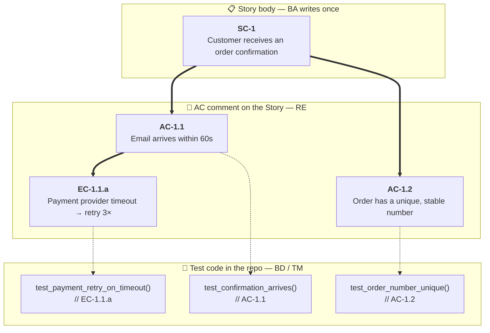
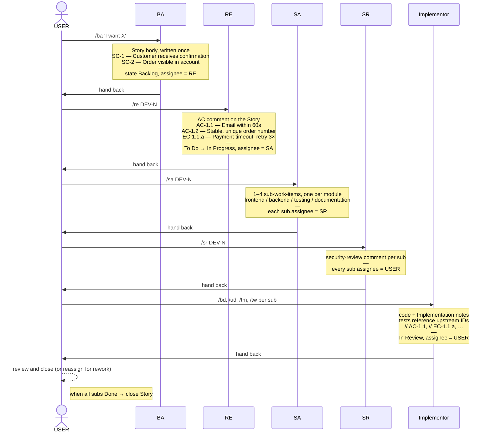

# Audit-trail-by-construction: a thesis for spec-driven AI coding

> **TL;DR.** [Trail](https://github.com/mahmadhuebsch/trail-aiac) is a
> multi-agent framework for Claude Code that uses Plane work-items as
> the audit bus. Requirements get stable IDs that
> thread all the way down into test-code annotations, so every line of
> AI-generated code can be traced back to a signed-off intent. Built
> for regulated work and security-critical systems, not for general
> velocity-first coding.

Most agentic frameworks for coding are built for velocity. They wire
up some agents — a planner, an architect, a coder, a reviewer — and
let them collaborate on a feature. What comes out is code, often
working code, in less time than a human would need.

That is fine, until you have to defend the code.

A regulator asks: who signed off on the threat model that justifies
this auth shortcut? A customer asks: which acceptance criterion does
this test actually prove? An incident review asks: when this
requirement got added, what was the original intent — was the
implementation true to it, or did the agent improvise? In a
velocity-first framework, the trail goes cold quickly. The agent did
it. A dev approved the PR. The "why" lives in a chat transcript that
got compacted twice and was partly summarised.

[Trail](https://github.com/mahmadhuebsch/trail-aiac) is a multi-agent
framework that takes the opposite bet: **discipline first, velocity
second.** The thesis: for software you eventually have to defend —
regulated industries, security-critical systems, anything that gets
reviewed by an auditor — the audit trail is not an afterthought. It
is the primitive.

The closest cousin to this approach is
[BMAD-METHOD](https://github.com/bmad-code-org/BMAD-METHOD), which
makes the same bet on partitioning AI agents by SDLC role under
explicit human direction. The load-bearing difference is where the
collaboration bus lives: BMAD uses Git plus markdown files in the
repo, while Trail uses Plane work-items with one ticket-system
account per persona — which is what makes the identity attribution
mechanically enforced rather than merely by convention.

## The discipline, in three rules

These three rules already carry most of the weight.

**Description-once.** A requirement is written once into a ticket
body and then never edited again. Refinements travel as comments.
No version-skew on what was actually agreed.

**Stable per-criterion IDs.** Every success criterion gets a `SC-N`.
Every acceptance criterion gets an `AC-N.M`. Edge cases get
`EC-N.M.x`. Non-functional requirements get `NFR-N`. Architectural
invariants live in a Control Manifest as `CM-N`. These IDs are
append-only — once they have been issued, they never move.

**Per-role identity in the ticket bus.** Each agent persona has its
own ticket-system account, and writes are attributed accordingly.
The board *is* the audit log: open it, scan a column, see which
named role designed, reviewed, implemented, or tested every change.

The IDs are the connective tissue. They thread from the Business
Analyst's intent down through the Software Architect's slices into
the implementor's test code — and they stay legible whether you
read them forward (intent → code) or backward (code → why).

## How it threads, visually



The Business Analyst writes a Story body once: "Customer places an
order", with two success criteria — `SC-1` (the customer receives a
confirmation) and `SC-2` (the order is visible in the customer's
account). The Requirements Engineer then adds a comment that refines
`SC-1` into testable acceptance criteria — `AC-1.1` (email arrives
within 60 seconds), `AC-1.2` (the order carries a unique and stable
number) — plus an edge case `EC-1.1.a` for the payment-provider
timeout. None of this overwrites anything; it is all append.

When the Backend Developer implements, every test carries an inline
comment that names the upstream ID it satisfies: `// AC-1.1`,
`// EC-1.1.a`. A `grep` for `// AC-` in the codebase enumerates the
acceptance criteria that already have proof. A `grep` for `AC-1.1`
traces a single criterion from BA intent down to the line of code
that proves it.

That is the audit trail you can show to anyone — auditor, customer,
incident reviewer — without having to interpret it. The IDs do not
need an explanation; the chain *is* the explanation.

## How a feature flows



Ten persona subagents collaborate through Plane work-items. (Plane
is an open-source ticket system — think of Jira's mental model on
self-hostable infrastructure.) The lifecycle is a state spine —
`Backlog → To Do → In Progress → In Review → Done` — and at every
transition a human pulls the trigger. There is no ticket-driven
autopilot. The user issues a slash command (`/ba`, `/re`, `/sa`,
`/sr`, `/bd`, `/ud`, `/tm`, `/tw`, `/rm`); the framework loads the
persona's role into Claude Code's main loop for that turn; the
persona writes the artefact, transitions the state, hands the
work-item to the next named role, and gives control back.

This is by design, not by accident. The slash-command rhythm forces
the human to read the ticket body, the comments, and the current
state before triggering the next persona. It removes the temptation
to wave everything through with one global "OK". Every turn is a
deliberate hand-off — one that the user has to actually engage with
before deciding to accept, reject, or send back for rework.

The handover is structural. BA hands to RE. RE hands to SA. SA cuts
the work into 1–4 sub-work-items, each in exactly one module
(`frontend` / `backend` / `testing` / `documentation`), and hands
them to SR. SR then posts security-review comments and hands back
to USER, who afterwards dispatches each sub-work-item to its
module's implementor. The implementors write code, post
Implementation notes, and put the sub-work-item into `In Review`.
USER closes — or reassigns for rework.

Every transition leaves a fingerprint in Plane: a state change, an
assignee change, a comment, a commenter. Nothing of it is
interpreted. All of it is queryable.

## What it costs

Spec-driven development has a known weakness, and the framework does
not paper over it. At the start of a Story, you can never cover
every use case and every eventuality — every spec is a snapshot of
what the author understood at that moment. Reality finds the gaps
later.

Because the description-once rule is taken seriously, you do not go
back and re-edit the Story body once those gaps surface. You cut a
follow-up Story instead. Each follow-up carries its own SC/AC/EC
IDs, its own audit chain, its own state spine. That is intentional —
it keeps every signed-off intent immutable — but it also means that
one feature can fan out into three or four tickets over its
lifetime as edge cases turn up. The board grows. Operators should
expect Story-fanout, not Story-condensation.

The other cost is throughput. The slash-command rhythm and the
per-turn engagement both slow things down considerably compared
to a velocity-first framework. That is the entire point — but you
should be honest with yourself about whether the trade-off makes
sense for what you are building.

## Try it — and an honest caveat

The framework lives at
[`github.com/mahmadhuebsch/trail-aiac`](https://github.com/mahmadhuebsch/trail-aiac).
The shortest path:

```bash
git clone https://github.com/mahmadhuebsch/trail-aiac
cd trail-aiac
claude
> /trail-install-helper
```

The install-helper is a meta-agent that walks you through three
scenarios — greenfield (Ansible provisions a Plane host for you),
existing Plane without agents, existing Plane with agents already
provisioned — and lands a working consumer project with the ten
personas wired in.

One operational note. The framework assumes a Claude Max 5x
subscription as the practical ceiling. That is roughly the level at
which a human can still read every ticket the agents are producing.
If you find yourself burning through significantly more, you are
not really reviewing any more — you are vibe-coding. No human can
process that much input consciously, which defeats the entire point
of the human-in-the-loop discipline.

Honest caveat: this is not for every team. Most teams do not need
that much rigour — they need velocity, and they should pick a
velocity-first framework. Trail is for the cases where someone,
eventually, will ask you to defend your code: regulated industries,
security-critical systems, agencies whose deliverables get reviewed
by auditors. In those settings, the discipline is not overhead. It
is the only thing that makes AI-generated code defendable.

Trail v0.1.0 is early beta. PRs and design feedback at
[`github.com/mahmadhuebsch/trail-aiac/issues`](https://github.com/mahmadhuebsch/trail-aiac/issues).

---

*Author's note: this article was drafted with
[Claude](https://claude.ai) — the same agent runtime that the
framework wraps — and edited by hand from there. The thesis, the
worked example, the trade-offs section, and the vibe-coding caveat
are mine; structure and phrasing had AI assistance throughout. Given
the topic, disclosure felt appropriate.*
